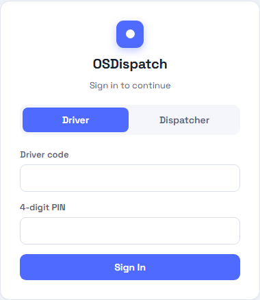
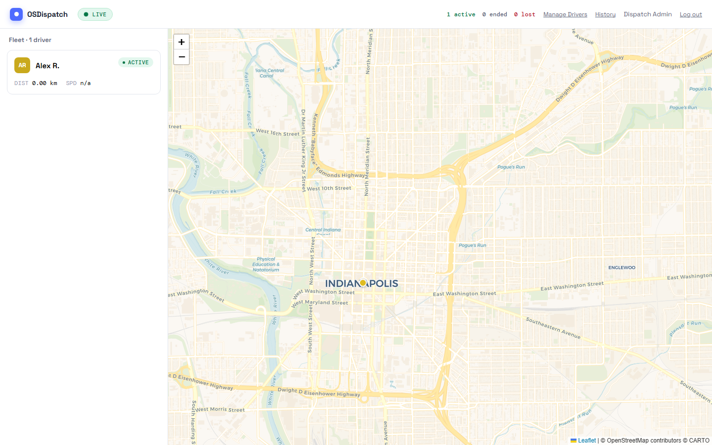
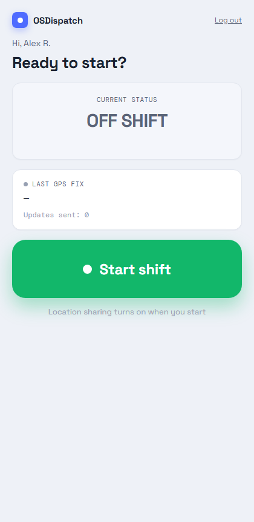
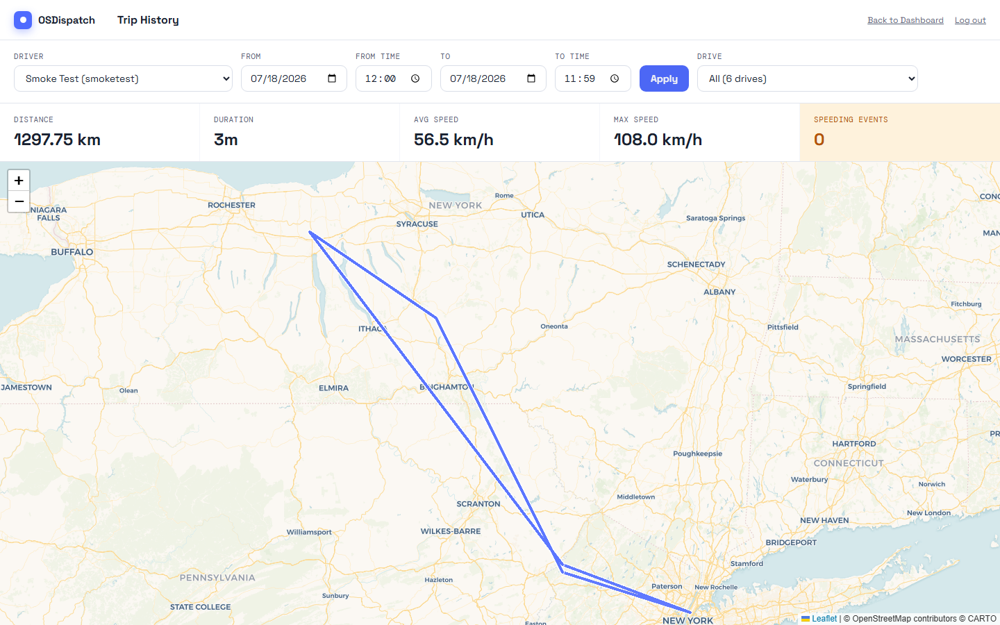
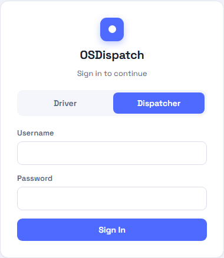
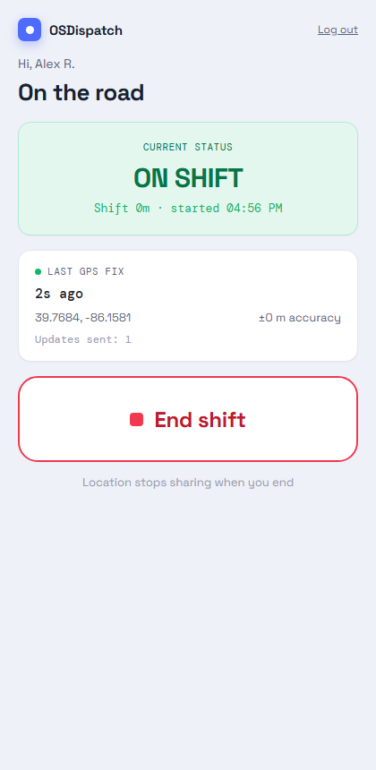
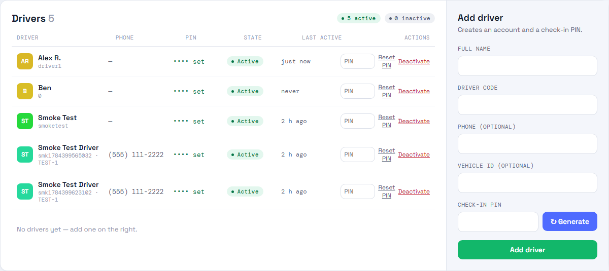

# OSDispatch

Real-time driver dispatch and tracking system. Drivers open a mobile webpage (no
native app), grant location permission, and stream their coordinates to a
dispatcher dashboard over Socket.io. Built with Express, Socket.io, Leaflet,
Postgres, and nginx, all run via Docker Compose.

## Screenshots

| | |
|---|---|
| **Sign in** — driver PIN / dispatcher password tabs | **Live dispatch dashboard** — fleet map with active driver markers |
|  |  |
| **Driver check-in** — off shift / on shift | **Trip history** — replayable route with distance/speed stats |
|  |  |

<details>
<summary>More screenshots (dispatcher sign-in, driver on shift, manage drivers)</summary>

| | |
|---|---|
|  |  |
|  | |

</details>

## Quick start

```bash
docker compose up -d --build
```

Then open **http://localhost:3331** (nginx is the only published port; the
app and database are internal to the Docker network).

## Default credentials

The stack ships with two **placeholder** accounts, seeded automatically the
first time it boots (from `db/seed-users.example.json`, since no
`db/seed-users.json` exists yet):

| Role | Sign-in | Value |
|---|---|---|
| Driver | Driver code | `driver1` |
| Driver | PIN | `1234` |
| Dispatcher | Username | `dispatch1` |
| Dispatcher | Password | `change-me-dispatch` |

Sign in at `http://localhost:3331/login` — there's a **Driver** tab (code +
4-digit PIN) and a **Dispatcher** tab (username + password).

**Change these before using this anywhere but local testing.** Once logged in
as `dispatch1`, use **Manage Drivers** in the dispatch dashboard header to add
real driver accounts, reset PINs, or deactivate drivers — no rebuild required.
Dispatcher accounts are still managed via `db/seed-users.json` (see below);
there's no in-app UI for creating additional dispatchers in this version.

To replace the placeholder accounts with real ones from the start, create
`db/seed-users.json` (same shape as `db/seed-users.example.json` — driver
entries use `"pin"`, dispatcher entries use `"password"`) before running
`docker compose up --build`. The seed step only ever creates missing
accounts — it never overwrites a credential you've since changed in the
database.

## Roles

- **Driver** (`/driver`) — Start/End Shift toggle, streams GPS location every
  ~7s while on shift. Requires a driver login (code + PIN).
- **Dispatcher** (`/dispatch`) — live map with driver markers, breadcrumb
  trails, and per-driver distance/speed. Requires a dispatcher login
  (username + password). Includes a **Manage Drivers** page
  (`/dispatch/drivers`) for creating, editing, deactivating/reactivating
  drivers and resetting PINs, and a **Trip History** page
  (`/dispatch/history`) for replaying a driver's route over a date/time
  range, with distance/duration/speed summaries and flagged speeding events.

## Configuration

Copy `.env.example` to `.env` and adjust as needed:

- `HTTP_PORT` — host port nginx publishes (default `3331`).
- `POSTGRES_USER` / `POSTGRES_PASSWORD` / `POSTGRES_DB` — Postgres credentials.
- `SESSION_SECRET` — express-session signing secret; set a long random value
  outside of local testing.
- `UNITS` — `metric` (default) or `imperial`. Distance/speed are always
  computed and stored in km / km/h regardless of this setting; it only
  affects how the dispatch dashboard displays them.
- `SPEED_LIMIT_LOOKUP` — `true` (default) or `false`. When enabled, each ping
  is tagged with the posted speed limit for the nearest tagged road (see
  below); set to `false` to disable if the app container has no outbound
  internet access.

## TLS / hostname

This nginx service terminates plain HTTP only — it's meant to sit behind a
separate TLS-terminating reverse proxy (e.g. Nginx Proxy Manager) that owns
the real hostname and certificate, and forwards to this stack's published
port. The app detects HTTPS via the `X-Forwarded-Proto` header (see
`nginx/default.conf`, which passes that header through rather than
overwriting it) and adjusts session cookies and HSTS accordingly — no app
config changes needed on this side when you add that proxy.

**Browsers block the geolocation prompt entirely on non-`localhost`,
non-HTTPS origins** — until a TLS-terminating proxy is actually in front of
this, `/driver` will not be able to request location from a real phone, no
matter what. `localhost` testing works either way.

## Known limitations

- **4-digit driver PINs** are a small keyspace (10,000 combinations). Login
  is rate-limited (10 attempts / 15 minutes per IP) to slow down brute-force
  guessing, but PINs are inherently weaker than passwords — treat driver
  accounts as lower-privilege by design.
- Driver "deletion" is a soft **deactivate**, not a hard delete — this
  preserves their historical `location_pings` rows (which reference the
  driver by foreign key) for reporting/audit.
- **Speed limits** are looked up from OpenStreetMap's public Overpass API —
  the nearest tagged road within 25m of each ping, cached to a ~111m grid and
  globally rate-limited to stay well under Overpass's fair-use policy. This
  means it's best-effort, not exhaustive: unmapped/untagged roads, cache
  misses under load, or an unreachable Overpass instance all just leave that
  ping's speed limit `null` rather than blocking or retrying aggressively.
  There's no OSM/Valhalla map-matching pipeline behind this — it's a nearby-
  way lookup, not routing.

## Project layout

```
dispatch tracker/
├── docker-compose.yml     # postgres + app + nginx
├── Dockerfile             # app image (node:20-alpine)
├── nginx/default.conf     # reverse proxy + WebSocket upgrade config
├── server.js              # Express + Socket.io + auth + telemetry
├── docs/screenshots/      # README screenshots
├── db/
│   ├── schema.sql         # idempotent schema, runs on every boot
│   ├── seed.js            # seeds users from seed-users.json (or the example)
│   └── seed-users.example.json
└── views/
    ├── login.html         # driver PIN / dispatcher password tabs
    ├── driver.html         # driver check-in page
    ├── dispatch.html       # dispatcher map dashboard
    ├── drivers.html        # driver management (dispatcher-only)
    └── history.html        # per-driver trip history, route replay + speeding events
```
